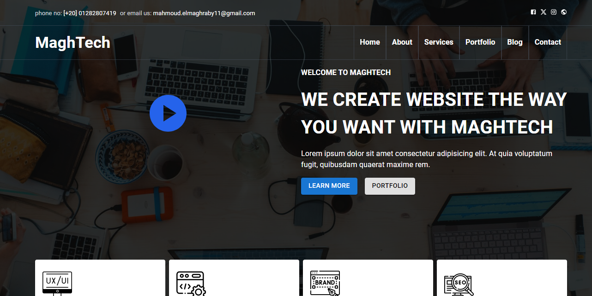
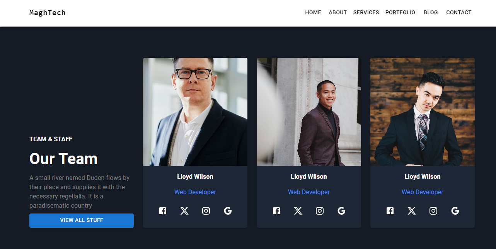
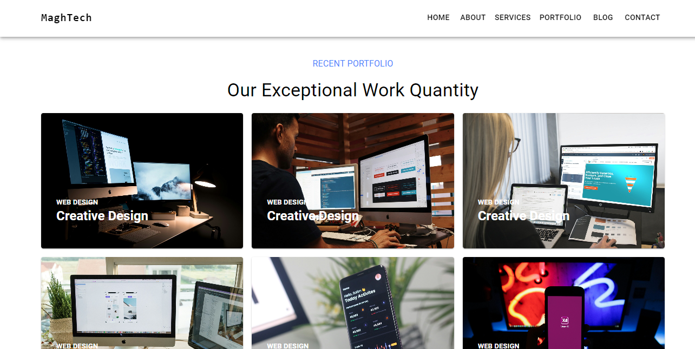
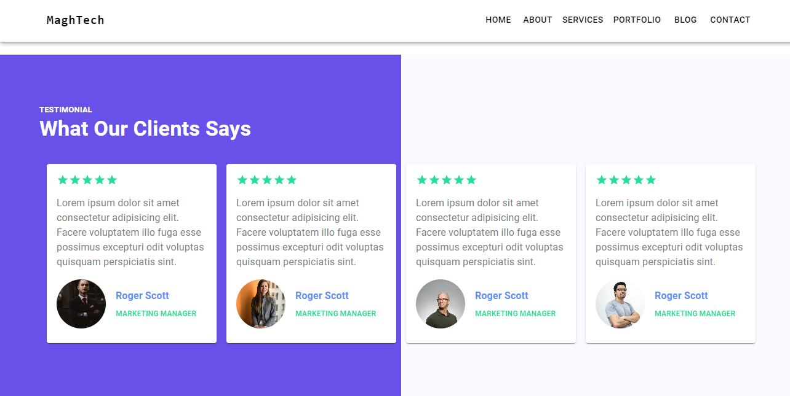
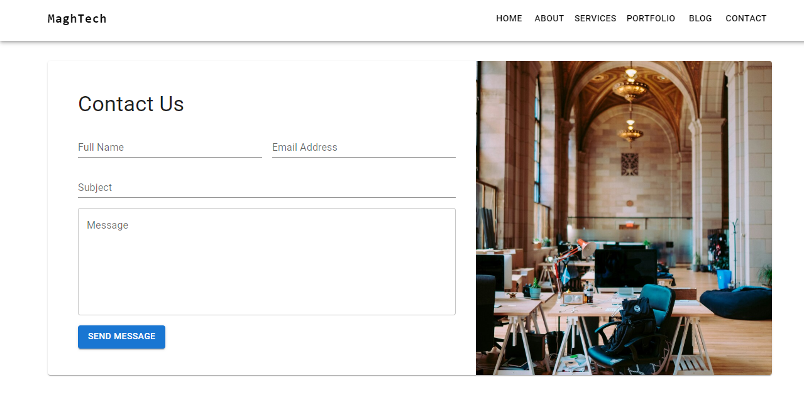

# Material UI Design

**Project Overview**

Material UI Design is a responsive, Material UI-based web application designed for corporate use. The project focuses on delivering a sleek, professional interface with a clean design that aligns with corporate branding and usability standards. Built with ReactJS and Material UI, this design provides a modern, efficient, and user-friendly experience that is fully responsive across devices.


## Features

- **Responsive Layout:** Designed to adapt seamlessly across devices, ensuring an optimal experience on mobile, tablet, and desktop.
- **Material UI Components:** Utilizes Material UI's extensive component library for a consistent and professional look.
- **Efficient State Management:** Modular design with a centralized context for scalable development.


## Tech Stack

- **ReactJS (VITE):** JavaScript library for fast, modern user interfaces.
- **MaterialUI:** Component library based on Google's Material Design, providing pre-styled and customizable UI components.

## Screenshots








## Demo

You can view a live demo of the project [here](https://maghtech-mui.vercel.app/).


## Installation

1. Clone the repository:

```bash
  git clone https://github.com/maghrabyy/mui-based-design.git
```
2. Navigate to the project directory:

```bash
cd mui-based-design
```
3. Install the necessary dependencies:

```bash
npm install
```

4. Start the development server:

```bash
npm run dev
```
    
## Project Structure

The project is structured to enhance maintainability and scalability, making it adaptable to various corporate needs. Here’s an overview:

- **/src**
  - **/assets:** Contains images, icons, and other static assets.
  - **/components:** Reusable UI components built with Material UI.
  - **/context:** Context API setup for state management across components.
  - **/layout:** Layout components to maintain a consistent structure.
  - **/pages:** Different pages and routes for the main application.

## 🚀 About Me

Hello! I’m **Mahmoud Elmaghraby**, a frontend developer with expertise in ReactJS and Material UI. I enjoy creating clean, responsive, and engaging user interfaces, especially for corporate applications. Feel free to connect with me or check out my other work!

- GitHub: [maghrabyy](https://github.com/maghrabyy)
- LinkedIn: [Mahmoud Elmaghraby](https://linkedin.com/in/maghrabyy)


## Contributing

Contributions are welcome! Feel free to submit issues or pull requests to improve the functionality or add new features.


## License
This project is licensed under the [MIT](https://choosealicense.com/licenses/mit/) License.


